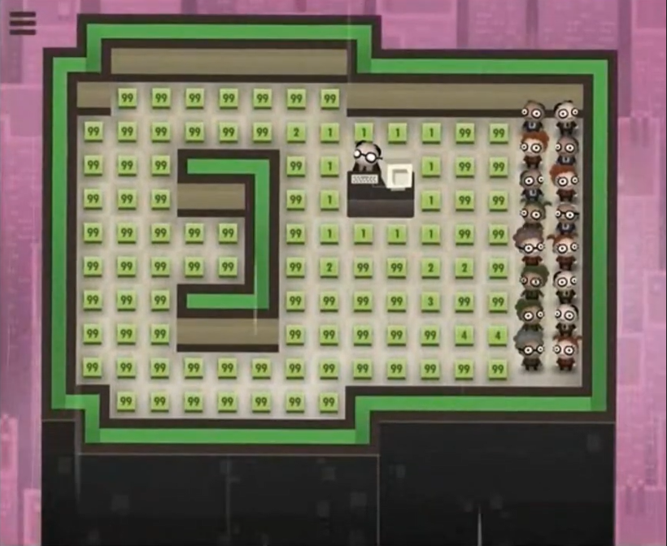

# Centre of Attention

|               |                                                                                                                  |
| ------------- | ---------------------------------------------------------------------------------------------------------------- |
| Difficulty:   | 3 kyu                                                                                                            |
| Instructions: | https://www.codewars.com/kata/58c8c723df10450b21000024/                                                          |
| Author:       | [geoffp](https://www.codewars.com/users/geoffp)                                                                  |
| Contributors: | [geoffp](https://www.codewars.com/users/geoffp)   [Blind4Basics](https://www.codewars.com/users/Blind4Basics) |
| First solved: | 09/09/2023                                                                                                       |
| Languages:    | JavaScript                                                                                                       |
| Tags          | Algorithms   Arrays                                                                                           |

This kata was my first foray into image processing. The problem reminded me of [Level 61: Lazy Pathways](https://youtu.be/kL0Z_DOEeuc?t=2766) of [Tomorrow Corporation](https://tomorrowcorporation.com/)'s brilliant programming game [7 Billion Humans](https://tomorrowcorporation.com/7billionhumans) (the follow-up to the equally brilliant [Human Resource Machine](https://tomorrowcorporation.com/humanresourcemachine)).

_7 Billion Humans, Level 61 ("Lazy Pathways"): All data cubes must display the minimum number of tiles the boss would have to walk to get to it._

There are, of course, some important differences regarding both the problem itself and the tools at our disposal. However, there was one important lesson I remembered from solving the level: when it comes to finding the shortest path for for some grid point to another, we can make our lives a lot easier by reusing paths we've already calculated - you'll see what I mean once we get to the solution!

## Theory

This is a very instructive kata in that it exemplifies the old wisdom that pretty much any (solvable) computational problem can be broken down into loops and conditional statements. While it did take me some time to figure out the exact solution, none of the individual steps requires more than a basic understanding of coding.

Note

While this has no impact on the solution, some readers may find it intersting that we are technically using a non-Euclidean geometry here, specifically a <a href='https://en.wikipedia.org/wiki/Taxicab_geometry'>taxicab geometry</a> (also known as Manhattan geometry), because a pixel's depth is effectively a <a href='https://en.wikipedia.org/wiki/Minkowski_distance'>Minkowski distance</a> of order 1. Indeed, we can easily rephrase the problem in classical taxicab-geometrical terms: in an idealised version of Manhattan where all blocks are perfectly square, what are the crossings that require the longest taxi journey to leave a given neighbourhood? 

## Strategy

The instructions kindly tell us that just two loops over the pixel data are sufficient. Since we are told that performance is a factor, let's aim for that from the get-go. Before we jump in, let's consider what exactly it is that we need to do during these loops:

1. identify all the pixels of the specified colour; for the sake of brevity, let's call them _c-pixels_; pixels of other colours (henceforth _non-c-pixels_) are only of interest insofar as they influence a c-pixel's depth;
2. determine each c-pixel's depth; and
3. identify the set of c-pixel's with the highest depth.

The crux, of course, is 2. A naive way to approach this would be to iterate over all our c-pixels and, for each one, keep moving away from it until we hit either an edge or a pixel of another colour. However, chances are that even if we got such a solution to work, it would time out. Instead, we can start from the following observations (the second of which was indeed my takeaway from the aforementioned _7 Billion Humans_ level):

- By definition, any c-pixel on the edge of the image or neighbouring a non-c-pixel will have a depth of 1.
- Any other c-pixel will be surrounded by c-pixels, and its depth will be _the minimum of its neighbours' depths + 1_.
- Moreover, even if we don't know the depth of a all of a c-pixel's neighbours yet, we know that if it has a neighbouring c-pixel of some depth d, its own depth will be <= d + 1.

Bearing this in mind, how can we determine the depth for every pixel of the specified colour with just two loops? The trick is to loop _forwards_ (i.e. from top-left to bottom-right) the first time and _backwards_ (i.e. from bottom-right to top-left) the second time.

During the first loop, we will check for each pixel whether it fits the specified colour. For each c-pixel, we will now check whether it a) is located at the edge of the image or b) has a neighbour of a different colour. If so, we already know that the pixel has a depth of 1; otherwise, we look at at the respective depths of its _top_ and _left_ neighbour (which we have already checked at this point), take whichever is smaller, and add 1; the result will be the length of the shortest path to an edge/non-c-pixel _starting with a step up or to the left_, and we assign this as a _provisional_ depth for the current c-pixel. (Note that while it is tempting to already keep track of the current maximum depth, we cannot do this as some of our provisionally calculated depths will almost certainly be too high!)

For the second loop, we will start in the bottom-right corner and work our way back, ignoring all non-c-pixels. For each c-pixel with a depth > 1, we will now check its _right_ and its _bottom_ neighbour. Either's depth + 1 is smaller than the pixel's provisional depth, we correct it. Note that we don't even have to look at the original image at this point, but are only concerned about our provisionally calculated depths. This time, we _will_ keep track of the current maximum depth in order to avoid further iterations. We will do this as follows:

1. Create a variable to keep track of the current maximum depth, initialised at 1 (any number < 1 works too).
2. Create an empty array to collect the indices of our central pixels.
3. During the (second) iteration, proceed as follows:
   - If the current pixel's depth equals the current max, add its index to the array.
   - If the current pixel's depth is _higher than_ the current maximum, set the maximum to the pixel's depth and replace the array with one containing only the current index.

This should work. The indices in our final array will be in reverse order, but the instructions make it clear that we needn't worry about that.

Let's do this!

## Implementation

### First draft

#### Testing

For testing and demonstration purposes, we are going to use the following sample image provided by the author:

As per the instructions, the actual input for our function will be

- `image`: `Image`
- `colour`: `Number`

where `Image` is defined as follows:

    class Image {
        constructor(data, w, h){
            this.pixels = data.slice();
            this.width = w;
            this.height = h;
        }
    }

We don't actually need to implement `Image` though. Instead, we can just mimic an instance with a simple object:

    const image = {
      pixels: [
        1, 1, 4, 4, 4, 4, 2, 2, 2, 2,
        1, 1, 1, 1, 2, 2, 2, 2, 2, 2,
        1, 1, 1, 1, 2, 2, 2, 2, 2, 2,
        1, 1, 1, 1, 1, 3, 2, 2, 2, 2,
        1, 1, 1, 1, 1, 3, 3, 3, 2, 2,
        1, 1, 1, 1, 1, 1, 3, 3, 3, 3,
      ],
      width: 10,
      height: 6
    }

#### Data accommodation

For our first draft, let's make our lives a bit easier and represent our data as a 2-dimensional matrix rather than a 1-dimensional array. This is most likely going to negatively influence performance (since the conversion takes time), but it is much more intuitive to think about an image as a 2D data structure - and we can always refactor it once we're happy with our algorithm as such. With `w` and `h` representing the image's width and height, we are going to evenly divide `image.pixles` into `h` subarrays of length `w`. We could do this by hand, but JavaScript's [Array.prototype.slice()](https://developer.mozilla.org/en-US/docs/Web/JavaScript/Reference/Global_Objects/Array/slice) is much neater:

    function central_pixels(image, colour) {
    // Convert 1D input into 2D array
        const rows = [];
        const [w, h] = [image.width, image.height];
        for (let i = 0; i < h; i++) {
            rows.push(image.pixels.slice(i * w, (i + 1) * w));
        }
        ...
    }

Note

Although each pixel is now uniquely identified by a pair of "coordinates" - e.g., `rows[0][0]` refers to the pixel in the top-left corner -, these are not to be mistaken for its x- and y-coordinates (as displayed by image processors). That's because we have to specify a pixel's row first and its column second, whereas classical 2D coordinates are to be read the other way round. In order to avoid confusion

#### First loop

There is no way around it: we need to iterate over the entire array of pixels to start with. As discussed, we are trying to get as much work done as we can. In order to keep track of our (provisional) depths, we are goign to create an isomorphic 2D matrix `depths`. For c-pixels, we store the provisional depth at the respective index; for other pixels, we store some falsey dummy value (`0` works here, but `null`, `NaN`, or `undefined` are just as good).

    // First loop
    const depths = [];
    let depth = 0;
    rows.forEach((row, i) => {
        depths.push([]);
        row.forEach((pixel, j) => {
            // Set a dummy value for all non-c-pixels
            if (pixel !== colour) depth = 0;
            else if (
                // Check if the pixel is on an edge
                i === 0 ||
                i === h - 1 ||
                j === 0 ||
                j === w - 1 ||
                // Check if a neighbouring pixel has a different colour
                rows[i - 1][j] !== pixel ||
                rows[i][j - 1] !== pixel ||
                rows[i + 1][j] !== pixel ||
                rows[i][j + 1] !== pixel
            ) {
                depth = 1;
            } else depth = Math.min(depths[i - 1][j], depths[i][j - 1]) + 1;
            depths[i].push(depth);
        });
    });

After the first iteration, we get the following initial results for our example:

        [
            [1, 1, 0, 0, 0, 0, 0, 0, 0, 0],
            [1, 2, 1, 1, 0, 0, 0, 0, 0, 0],
            [1, 2, 2, 1, 0, 0, 0, 0, 0, 0],
            [1, 2, 3, 2, 1, 0, 0, 0, 0, 0],
            [1, 2, 3, 3, 1, 0, 0, 0, 0, 0],
            [1, 1, 1, 1, 1, 1, 0, 0, 0, 0]
        ]

That's already pretty good! The only incorrect values at this point are (4, 2) and (4, 3), which should both have a depth of 2. Since both these pixels' shortest paths must start with either a step right or a step down, we simply could not calculate them correctly during the first loop.

#### Second loop

During the second loop, we want to achieve two things:

1.  We want to fix any incorrect values in our initial array. For this purpose, we are going to iterate _backwards_ this time. Again, note that we don't even have to look at the original array anymore - `depths` will do.
2.  We want to keep track of the central pixels, i.e. those with the highest depth.

        for (let i = h - 1; i >= 0; i--) {
            const depthRow = depths[i];
            for (let j = w - 1; j >= 0; j--) {
                let pixelDepth = depthRow[j];
                // Ignore non-c-pixels
                if (pixelDepth) {
                    // Check for shorter paths to the bottom and to the right
                    if (pixelDepth > 1) {
                        const minDepthBR = Math.min(depths[i + 1][j], depths[i][j + 1]);
                        if (minDepthBR < pixelDepth - 1) {
                            pixelDepth = minDepthBR + 1;
                            depthRow[] = pixelDepth;
                        }
                    }
                }
            }
        }

After this loop, our `depths` matrix looks like this:

    [
      [1, 1, 0, 0, 0, 0, 0, 0, 0, 0],
      [1, 2, 1, 1, 0, 0, 0, 0, 0, 0],
      [1, 2, 2, 1, 0, 0, 0, 0, 0, 0],
      [1, 2, 3, 2, 1, 0, 0, 0, 0, 0],
      [1, 2, 2, 2, 1, 0, 0, 0, 0, 0],
      [1, 1, 1, 1, 1, 1, 0, 0, 0, 0]
    ]

Spot on! Now all we have to do is find all occurrences of the highest value and, in this solution, translate their 2D coordinates back into a 1D index. We could, of course, use another loop here, but that's actually not necessary - we can already do that during our second loop. For this purpose, we initialise two variables:

    let maxDepth = 1; //
    let centralPixels = [];

If we encounter a c-pixel with the current maximum depth, we add its index (which we can reconstruct based on its "coordinates") to our list of central pixels. If we encounter a c-pixel with a depth higher than the current maximum, we reset the list such that it only contains that pixel's index and set the new maximum depth accordingly:

    if (pixelDepth === maxDepth) centralPixels.push(i * w + j);
    else if (pixelDepth > maxDepth) {
        maxDepth = pixelDepth;
        centralPixels = [i * w + j];
    }

Full solution

    function central_pixels(image, colour) {
        // Convert 1D input into 2D array
        const rows = [];
        const [w, h] = [image.width, image.height];
        for (let i = 0; i < h; i++) {
            rows.push(image.pixels.slice(i * w, (i + 1) * w));
        }

        // First loop
        const depths = [];
        let depth = 0;
        rows.forEach((row, i) => {
            depths.push([]);
            row.forEach((pixel, j) => {
            // Set dummy value for all pixels of colours other than the specified one
            if (pixel !== colour) depth = 0;
            else if (
                // Check if the pixel is on an edge
                i === 0 ||
                i === h - 1 ||
                j === 0 ||
                j === w - 1 ||
                // Check if a neighbouring pixel has a different colour
                rows[i - 1][j] !== pixel ||
                rows[i][j - 1] !== pixel ||
                rows[i + 1][j] !== pixel ||
                rows[i][j + 1] !== pixel
            ) {
                depth = 1;
            } else depth = Math.min(depths[i - 1][j], depths[i][j - 1]) + 1;
            depths[i].push(depth);
            });
        });

        // Second loop
        let maxDepth = 1;
        let centralPixels = [];

        for (let i = h - 1; i >= 0; i--) {
            const depthRow = depths[i];
            for (let j = w - 1; j >= 0; j--) {
            let pixelDepth = depthRow[j];
            // Ignore pixels of other colours
                if (pixelDepth) {
                    // Check for shorter paths to the bottom and to the right and correct depth if necessary
                    if (pixelDepth > 1) {
                        const minDepthBR = Math.min(depths[i + 1][j], depths[i][j + 1]);
                        if (minDepthBR < pixelDepth - 1) {
                            pixelDepth = minDepthBR + 1;
                            depthRow[j] = pixelDepth;
                        }
                    }
                    if (pixelDepth === maxDepth) centralPixels.push(i * w + j);
                    else if (pixelDepth > maxDepth) {
                        maxDepth = pixelDepth;
                        centralPixels = [i * w + j];
                    }
                }
            }
        }
        return centralPixels;
    }

Finally, we just need to return our array `centralPixels`. _Et voilà_, our solution passes not only the sample tests indeed the kata autor's full test suite (which, as per the instructions, includes a `Big_Test` suite using a 16-megapixel image in the JavaScript version). Completion took **1226ms** for my first attempt, which were spread across the 5 test suites as follows:
| Test Suite | Completion Time |
| --- | --- |
| Example_In_The_Picture | 3ms |
| Circular_Disc_Test | 11ms |
| Diagonal_Test | 3ms |
| Random_Tests | 35ms |
| Big_Test | 1174ms |

### Refactoring & Optimisation

Work in progress - watch this space ;)
